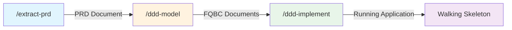
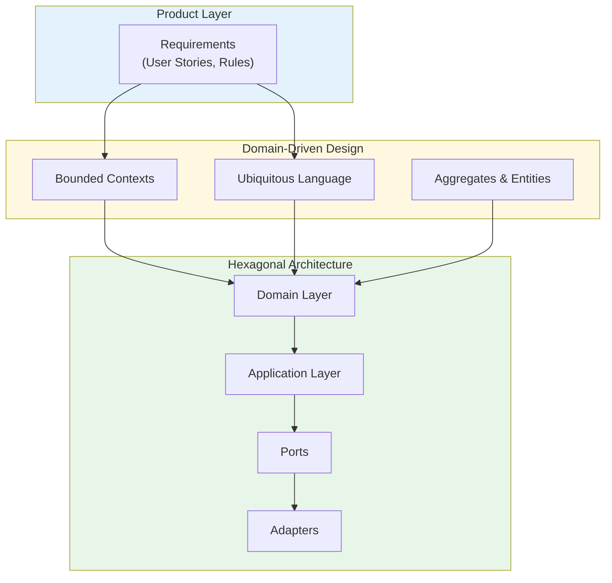
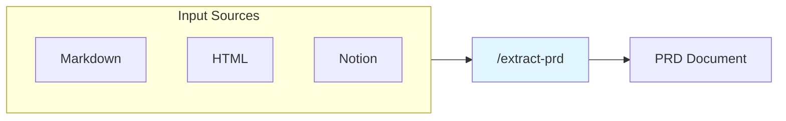
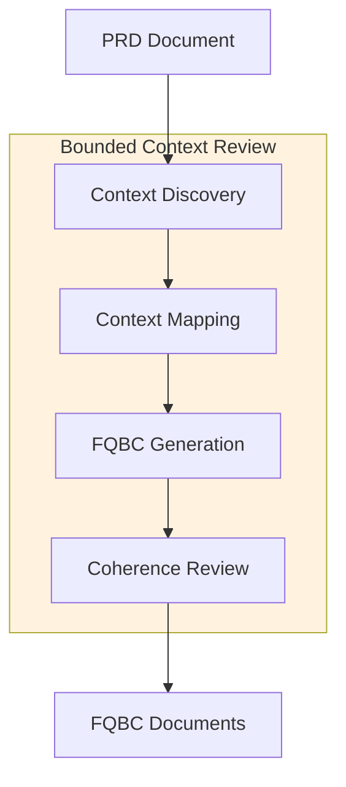
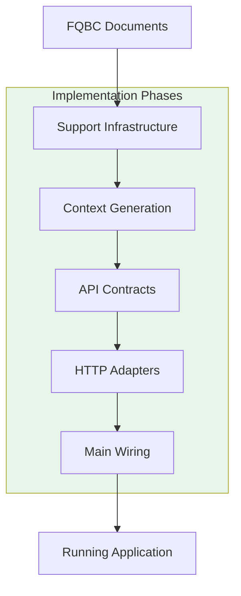

# DDD Companion

Transform product requirements into a production-shaped **walking skeleton** using Claude Code skills.

A walking skeleton is a minimal implementation that connects all architectural layers end-to-end without significant business logic—an architectural proof-of-concept designed to evolve into the product.



## Quick Start

```claude
# 1. Extract PRD from your product documentation
/extract-prd ./requirements.md
/clear

# 2. Model bounded contexts (DDD)
/ddd-model
/clear

# 3. Generate the walking skeleton
/ddd-implement
```

Each skill is interactive and guides the user through its phases. The human-in-the-loop is essential—Claude presents findings at each stage and waits for confirmation before proceeding.

### Prerequisites

- **Go 1.21+** — for skeleton compilation and execution
- **Node.js 18+** — for TypeSpec API contract compilation (runs `npm install` in `/api`)
- **Claude Code** — with skills installed (see Installation)

---

## Current Status

This pipeline is a **work in progress**. Current scope:

| Area | Status |
|------|--------|
| **Scope** | Initial skeleton only — incremental changes after the skeleton is built are not covered |
| **Backend language** | Go only (hexagonal architecture patterns are language-specific) |
| **PRD sources** | Markdown, HTML (URL or local file), Notion |
| **Frontend** | Not included — generate a disposable prototype separately for API validation |
| **Database adapters** | Mock/in-memory only (real adapters are implementation work) |
| **Tests** | Not generated — architecture supports testing, but no test files are created |

The pipeline produces a backend walking skeleton. Frontend development happens in parallel, using the generated OpenAPI spec and mock API.

---

## Why This Approach?

### The Problem

Transforming product requirements into working software typically involves:

- Lengthy requirement analysis cycles
- Architecture decisions made in isolation from requirements
- Implementation drift from original intent
- Late discovery of integration issues

### The Approach: Product → DDD → Hexagonal

The combination of DDD and hexagonal architecture is well-established. This pipeline uses Claude to handle the **mechanical translation between stages** — extracting domain concepts from requirements, mapping them to bounded contexts, and generating the skeleton code. Human review at each stage preserves alignment while reducing the manual work.

The value is twofold:

1. **Tighter feedback loop** — A running mock API is reached quickly, enabling a disposable UI prototype to validate use cases with stakeholders before investing in full implementation.

2. **Solid foundation from day one** — Unlike a throwaway prototype, the walking skeleton is structured for production. Once validated, the team moves forward with it — adding business logic and swapping mock adapters for real ones without restructuring. The cost of building a proper foundation is reduced to the point where validation happens with production-shaped code instead of a disposable mock.



**Why DDD?**

- Provides a shared language between product and engineering
- Naturally decomposes systems along business boundaries
- Business rules live in the domain, not scattered across layers
- Changes in one context don't ripple unpredictably

**Why Hexagonal Architecture?**

- **Ports as explicit contracts** — The boundary between domain and infrastructure is a defined interface, not an implicit dependency
- **Symmetric adapter model** — Driving adapters (HTTP, CLI) and driven adapters (DB, events) follow the same pattern, making the architecture predictable
- **Walking skeleton friendly** — Define ports first, plug in mock adapters, run immediately; swap for real adapters later without touching domain code

**Why they fit together:**

- DDD's bounded contexts map directly to independent modules
- Hexagonal ports define the contract between contexts
- The ubiquitous language flows from PRD → domain code
- Business rules from requirements become domain invariants

---

## Pipeline Stages

### Stage 1: Extract PRD (`/extract-prd`)

Extracts a lean, DDD-ready Product Requirements Document from source documentation.



**Supported input formats:**

| Format | Example |
|--------|---------|
| Markdown | `/extract-prd ./docs/requirements.md` |
| HTML (local) | `/extract-prd ./exports/spec.html` |
| HTML (URL) | `/extract-prd https://docs.example.com/spec.html` |
| Notion | `/extract-prd https://notion.so/your-page` |

Markdown is recommended as the most portable format. Notion requires the Notion MCP integration.

**Phases:**

1. **Discovery** — Understand project purpose, goals, key entities
2. **Scope Definition** — Identify minimum viable PoC features, group by functional area
3. **Functional Requirements** — Detail requirements with business rules, entities, roles
4. **Document Generation** — Produce final PRD with DDD-ready artifacts

**Output:** A structured PRD containing:

- Domain glossary (seeds the ubiquitous language)
- Business rules catalog
- Functional areas (candidates for bounded contexts)
- Conceptual entity map
- Integration touchpoints

### Stage 2: Model Bounded Contexts (`/ddd-model`)

Decomposes the system into well-defined bounded contexts using DDD principles.



**Phases:**

1. **Context Discovery** — Identify candidate bounded contexts from PRD
2. **Context Mapping** — Define relationships between contexts (upstream/downstream, patterns)
3. **FQBC Generation** — Create Fully Qualified Bounded Context documents (one per context)
4. **Coherence Review** — Verify boundaries align and API surface is consistent

**Output:** For each bounded context:

- Ubiquitous language glossary
- Domain model (entities, value objects, aggregates)
- Commands, queries, and domain events
- Published interface and API bindings
- Integration patterns with other contexts

**Built-in defaults:** When the PRD doesn't specify API design principles, the skill applies standard HTTP conventions (URL structure, response envelopes, error handling, pagination) automatically.

### Stage 3: Generate Walking Skeleton (`/ddd-implement`)

Transforms bounded context definitions into a runnable Go application with hexagonal architecture.



**For each bounded context, generates:**

- Domain layer (entities, value objects, events)
- Ports (primary and secondary interfaces)
- Application layer (use case orchestration)
- Driven adapters (in-memory repositories)
- Mock implementations with test data

**Then generates:**

- TypeSpec API contracts
- HTTP handlers (driving adapters)
- Main wiring with mock/live mode switching
- README with usage instructions

**Output:** A runnable Go application:

```bash
# Runs immediately with mock data
go run ./cmd/server

# Ready for frontend integration
curl http://localhost:8080/api/...
```

---

## Artifacts Overview

```
project/
├── ddd-workspace/
│   ├── ddd-model.manifest.json     # BCR workflow state (Stage 2)
│   ├── ddd-implement.manifest.json # Implementation state (Stage 3)
│   ├── prd/
│   │   └── prd.md                  # PRD document
│   ├── bcr/
│   │   ├── context-discovery.md
│   │   ├── context-map.md
│   │   └── coherence-review.md
│   └── fqbc/
│       ├── context-a.md            # One per bounded context
│       └── context-b.md
├── api/
│   ├── main.tsp                    # TypeSpec API contracts
│   ├── package.json                # TypeSpec dependencies
│   └── tsp-output/
│       └── openapi/
├── cmd/server/
│   └── main.go
├── internal/
│   ├── {context}/                  # Per bounded context
│   │   ├── domain/
│   │   ├── application/
│   │   ├── ports/
│   │   └── mock/
│   ├── adapters/
│   └── support/
└── README.md
```

### Session Resumption

Both `/ddd-model` and `/ddd-implement` track progress in manifest files. If a session is interrupted:

1. Re-run the same command (`/ddd-model` or `/ddd-implement`)
2. The skill reads the manifest and reports current progress
3. Work continues from the last checkpoint

This allows complex modeling and generation work to span multiple chat sessions without losing progress.

---

## Installation

### Option 1: User-Level Skills via Symlinks (Recommended)

Install skills globally using symbolic links. This keeps skills synced with the source repository:

```bash
# Clone or download this repository
git clone https://github.com/jrlangford/ddd-companion.git
cd ddd-companion

# Create user skills directory if it doesn't exist
mkdir -p ~/.claude/skills

# Create symbolic links for each skill
ln -s "$(pwd)/skills/ddd-extract-prd" ~/.claude/skills/ddd-extract-prd
ln -s "$(pwd)/skills/ddd-model" ~/.claude/skills/ddd-model
ln -s "$(pwd)/skills/ddd-prd" ~/.claude/skills/ddd-prd
```

Skills are now available in all your projects. Updates to the source repository are reflected immediately.

### Option 2: Project Skills

Copy skills directly into a specific project:

```bash
# Copy skills to your project
cp -r {path/to/ddd-companion}/skills/ {your-project}/.claude/skills/
```

Skills are available only when you run Claude Code in that directory.

---

## Walkthrough Example

Let's walk through the pipeline with a hypothetical "Task Management" application.

### Step 1: Extract PRD

```claude
> /extract-prd ./docs/task-management-requirements.md

## Project Discovery Summary

**Source**: Markdown file (./docs/task-management-requirements.md)
**Project**: Task Management System

### Goals
- Enable teams to track and manage tasks
- Support task assignment and status workflows
- Provide visibility into team workload

### Key Entities Identified
- Task — core work unit with status, assignee, due dates
- Project — grouping of related tasks
- Team Member — user who can be assigned tasks

### Initial Domain Terms
Task, Project, Assignee, Status, Due Date, Priority, Sprint

**Shall I proceed to identify PoC scope?**
```

After reviewing and confirming each phase, the output is a PRD with:
- Functional areas: Task Management, Project Organization, Team Collaboration
- Business rules: "A task can only be assigned to active team members"
- Domain glossary with precise definitions

### Step 2: Model Bounded Contexts

```
> /ddd-model

## BCR Workflow Status

**Project**: Task Management System
**PRD**: prd/prd.md (markdown)
**Current Phase**: Starting

### Starting Context Discovery...

Based on the PRD analysis, I've identified 3 candidate bounded contexts:

1. **Task Management** (Core)
   - Owns: Task entity, Status transitions
   - Cohesion: All task lifecycle operations

2. **Project Organization**
   - Owns: Project entity, Task groupings
   - Cohesion: Project structure and hierarchy

3. **Identity** (Supporting)
   - Owns: Team Member, Permissions
   - Cohesion: Who can do what

**Does this decomposition look right?**
```

After completing all phases, the output includes FQBC documents defining:
- Each context's ubiquitous language
- Domain models with entities and value objects
- Commands (CreateTask, AssignTask) and queries (ListTasks)
- API bindings (POST /api/tasks, PATCH /api/tasks/{id}/assign)

### Step 3: Generate Walking Skeleton

```
> /ddd-implement

## Implementation Status

**Project**: task-management
**Module**: github.com/acme/task-management
**Current Phase**: Starting

### Generating support infrastructure...
✓ internal/support/basedomain/
✓ internal/support/auth/
✓ internal/support/eventbus/
...

### Generating context: task-management...
✓ internal/taskmanagement/domain/
✓ internal/taskmanagement/ports/
✓ internal/taskmanagement/application/
✓ internal/taskmanagement/mock/

### Generating TypeSpec API contracts...
✓ api/task-management/endpoints.tsp

### Generating HTTP adapters...
✓ internal/adapters/driving/httpadapter/

### Build verification...
✓ go build ./... succeeded

## Walking Skeleton Complete!

Run the server:
  go run ./cmd/server

The API is available at http://localhost:8080
```

The walking skeleton now:
- Compiles and runs
- Serves mock data via REST API
- Has `// TODO:` markers where business logic belongs
- Is ready for parallel frontend development

---

## What's Next After the Skeleton?

The walking skeleton is **not** the finished product. It's a foundation:

1. **Add business logic** — Replace `// TODO:` markers with actual domain rules
2. **Implement real adapters** — Swap in-memory repos for databases
3. **Add tests** — The architecture is already testable
4. **Iterate with product** — The mock API enables early feedback

The architecture ensures that adding flesh to the bones doesn't require structural changes.

### Cross-Context Communication

Bounded contexts communicate through:

- **Domain Events** — Contexts publish events when significant state changes occur
- **Event Bus** — The skeleton includes an in-memory event bus (`internal/support/eventbus/`)
- **Subscriptions** — Contexts subscribe to events from other contexts in main wiring

The context map (from Stage 2) defines which contexts consume events from which producers. The skeleton wires these relationships but leaves event handlers as `// TODO:` markers.

---

## What's Not Covered

The pipeline generates a skeleton, not a production system. You'll need to handle:

| Area | What to Do |
|------|------------|
| **Real database adapters** | Implement repository interfaces with PostgreSQL, MongoDB, etc. |
| **Authentication** | Integrate with your identity provider (the skeleton has auth middleware stubs) |
| **Tests** | Write unit tests for domain logic, integration tests for adapters |
| **Deployment** | Add Dockerfile, CI/CD, infrastructure-as-code |
| **Monitoring** | Add observability (metrics, tracing, structured logging) |
| **Frontend** | Build separately using the generated OpenAPI spec |

The skeleton provides the structure; you provide the implementation.

---

## Skills Reference

| Skill | Purpose | Input | Output |
|-------|---------|-------|--------|
| `/extract-prd` | Extract DDD-ready PRD from product docs | Markdown, HTML (local/URL), or Notion | Markdown PRD |
| `/ddd-model` | Decompose into bounded contexts | Markdown PRD (from extract-prd) | FQBC documents |
| `/ddd-implement` | Generate walking skeleton | FQBC documents | Running Go application |

For detailed documentation, see the skill files directly:
- [ddd-extract-prd/SKILL.md](skills/ddd-extract-prd/SKILL.md)
- [ddd-model/SKILL.md](skills/ddd-model/SKILL.md)
- [ddd-prd/SKILL.md](skills/ddd-prd/SKILL.md)

### Skill Locations

Skills can be installed at two levels:

| Location | Scope | Path |
|----------|-------|------|
| **User** | All your projects | `~/.claude/skills/` |
| **Project** | This project only | `./.claude/skills/` |

Project-level skills take precedence over user-level skills with the same name. User-level symlinks (Option 1) are recommended because they stay in sync with the source repository.

---

## Contributing

This pipeline is opinionated by design. Contributions that align with the core principles are welcome:
- Human-in-the-loop at each stage
- DDD as the bridge between product and code
- Hexagonal architecture for testability and flexibility
- Walking skeleton as the target, not full implementation

---

## License

This project has been published under the MIT License. You can find it [here](LICENSE).
