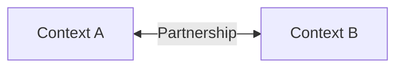
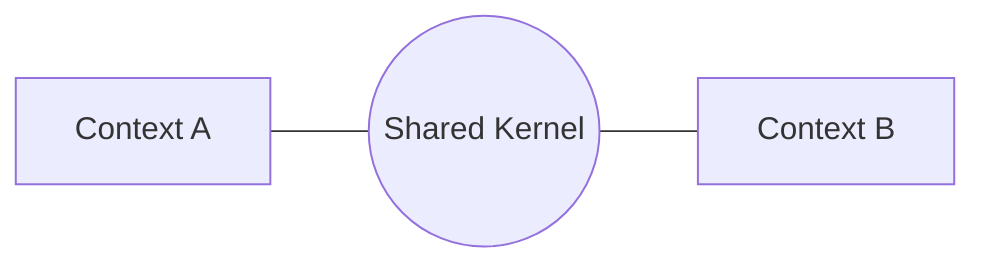
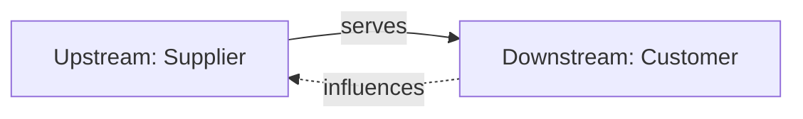
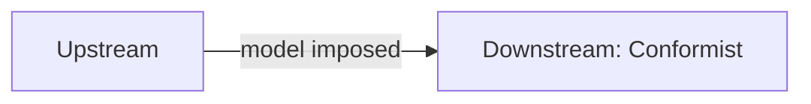
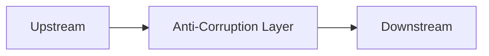
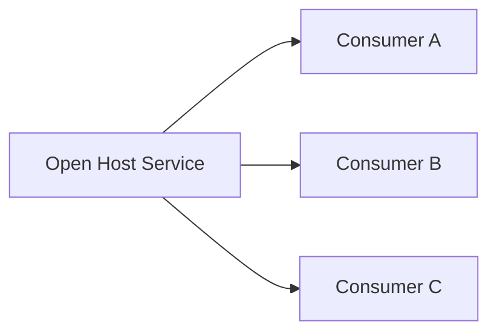
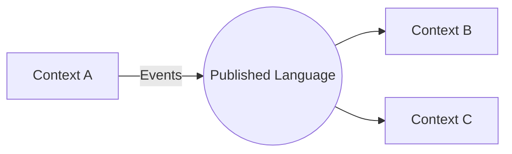
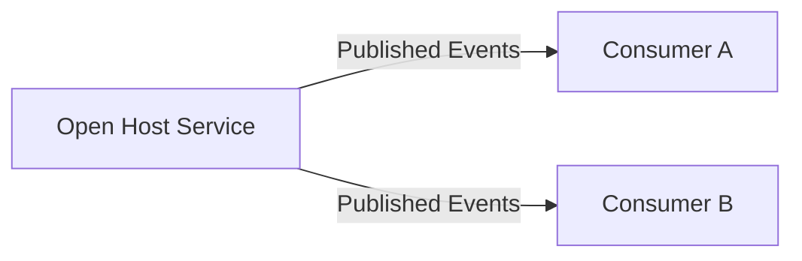
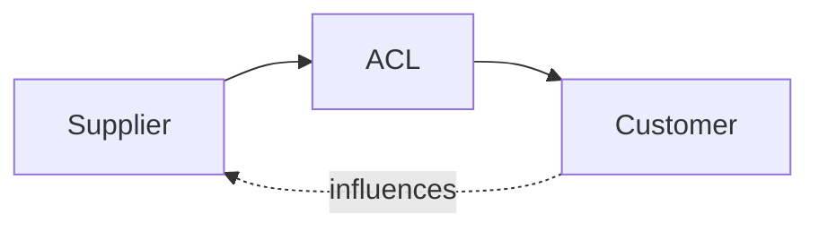
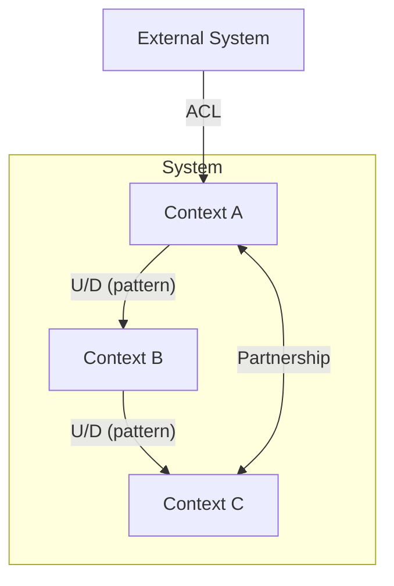

# Context Mapping Patterns

Reference for selecting appropriate integration patterns between Bounded Contexts.

## Pattern Selection Guide

| Situation | Recommended Pattern |
|-----------|---------------------|
| Same team, co-evolving contexts | Partnership |
| Small shared model, coordinated changes | Shared Kernel |
| Clear producer/consumer, consumer has influence | Customer-Supplier |
| Consumer must accept producer's model | Conformist |
| Consumer must protect its model from producer | Anti-Corruption Layer |
| Producer serves many consumers with stable API | Open Host Service |
| Contexts communicate via well-defined schema | Published Language |
| No integration needed | Separate Ways |

---

## Pattern Details

### Partnership

**When**: Two contexts co-evolve together, typically owned by the same team or tightly coordinating teams.

**Characteristics**:
- Mutual dependency
- Coordinated planning and releases
- Shared success/failure

**Signals**:
- Teams sit together or communicate daily
- Changes to one context often require changes to the other
- No clear upstream/downstream

**Risks**:
- Can become a distributed monolith
- Coordination overhead scales with team size

**Diagram**:

---

### Shared Kernel

**When**: A small, well-defined part of the model is shared between contexts.

**Characteristics**:
- Limited shared code/model
- Any change requires agreement from both teams
- Tight coupling by design (for specific reason)

**Signals**:
- Common domain concepts that must stay synchronized
- Core identity or reference data
- Very stable, rarely-changing shared elements

**Risks**:
- Kernel can grow uncontrolled
- Change coordination becomes bottleneck
- Temptation to share too much

**Guidelines**:
- Keep kernel as small as possible
- Document exactly what's shared and why
- Require explicit approval for kernel changes

**Diagram**:

---

### Customer-Supplier

**When**: Clear upstream (supplier) and downstream (customer) relationship where the customer can influence the supplier's priorities.

**Characteristics**:
- Downstream depends on upstream
- Downstream needs are considered in upstream planning
- Negotiated interface

**Signals**:
- Downstream team can request features/changes
- Upstream team accepts responsibility to serve downstream
- Power balance allows negotiation

**Diagram**:

---

### Conformist

**When**: Downstream must accept the upstream model without ability to influence it.

**Characteristics**:
- Downstream adopts upstream's model as-is
- No translation layer
- Upstream dictates terms

**Signals**:
- External service or legacy system
- Upstream team has no bandwidth for downstream needs
- Upstream model is acceptable (not harmful) to downstream

**Risks**:
- Downstream model polluted by upstream concepts
- Changes in upstream ripple through downstream

**When NOT to Use**:
- If upstream model would corrupt downstream domain, use ACL instead

**Diagram**:

---

### Anti-Corruption Layer (ACL)

**When**: Downstream must protect its model from upstream concepts that don't fit.

**Characteristics**:
- Translation layer between contexts
- Downstream model stays pure
- Adapter pattern at the boundary

**Signals**:
- Upstream uses different terminology
- Upstream model would pollute downstream domain
- Legacy system integration
- Third-party API with foreign concepts

**Implementation**:
- Translators: Convert between models
- Adapters: Wrap upstream interfaces
- Facades: Simplify upstream complexity

**Diagram**:

---

### Open Host Service

**When**: Upstream provides a well-defined, stable protocol for many consumers.

**Characteristics**:
- Public API or service
- Multiple downstream consumers
- Versioned, documented interface

**Signals**:
- Context serves as a platform
- Multiple teams consume the service
- Need for stability and backward compatibility

**Combines With**: Often uses Published Language for the protocol definition.

**Diagram**:

---

### Published Language

**When**: Contexts communicate via a well-documented, shared interchange format.

**Characteristics**:
- Common schema/protocol
- Not a shared model (just interchange format)
- Often events or data contracts

**Signals**:
- Event-driven architecture
- Multiple producers/consumers of same message type
- Need for interoperability

**Examples**:
- Domain events with defined schema
- Industry-standard formats
- Protocol buffers, JSON schemas

**Diagram**:

---

### Separate Ways

**When**: No integration needed between contexts.

**Characteristics**:
- Contexts operate independently
- No shared data or communication
- Duplication is acceptable

**Signals**:
- Integration cost exceeds benefit
- Contexts serve completely different purposes
- Data overlap is minimal and can be duplicated

**Risks**:
- May miss legitimate integration needs
- Data inconsistency if contexts do overlap

---

## Combination Patterns

Patterns often combine:

### Open Host + Published Language
Standard pattern for event-driven systems:

### Customer-Supplier + ACL
When downstream has influence but still needs protection:

---

## Context Map Diagram Conventions

### Standard Notation

**Legend**:
- `U/D`: Upstream/Downstream direction
- Solid arrows: Data/message flow
- Dashed arrows: Influence
- Double arrows: Bidirectional (Partnership)

### Relationship Documentation

For each relationship, document:

| Aspect | Description |
|--------|-------------|
| **Pattern** | Selected integration pattern |
| **Direction** | Who is upstream/downstream |
| **Interface** | Commands, Events, Queries exchanged |
| **Translation** | If ACL, what gets translated |
| **Rationale** | Why this pattern was chosen |
| **PRD Ref** | Integration touchpoint IDs |
