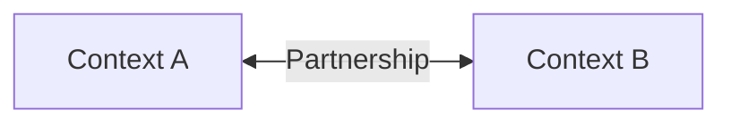
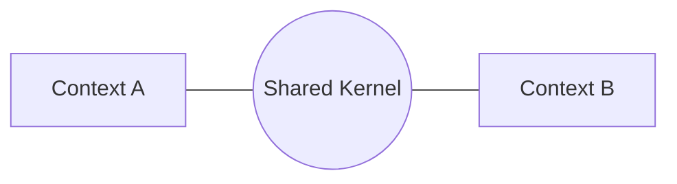
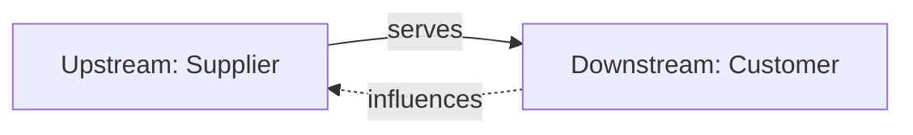
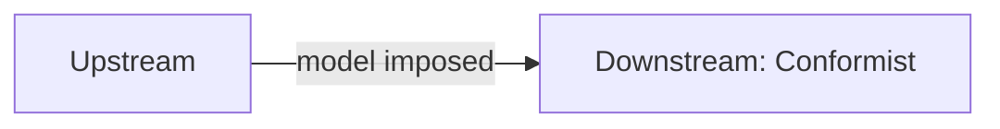
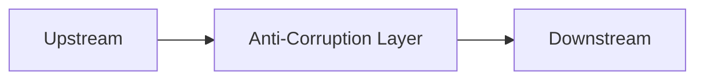
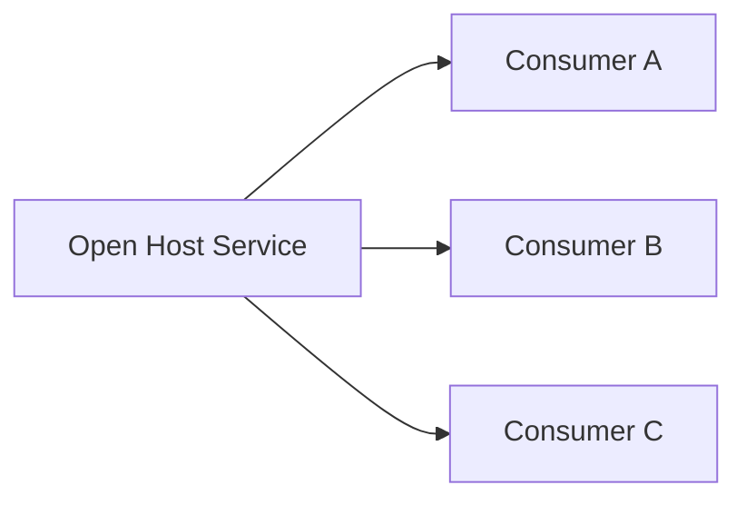
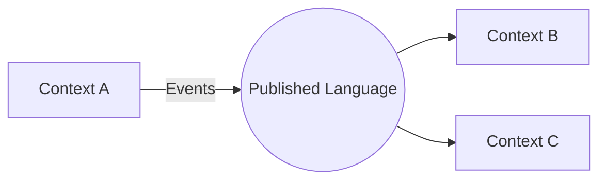
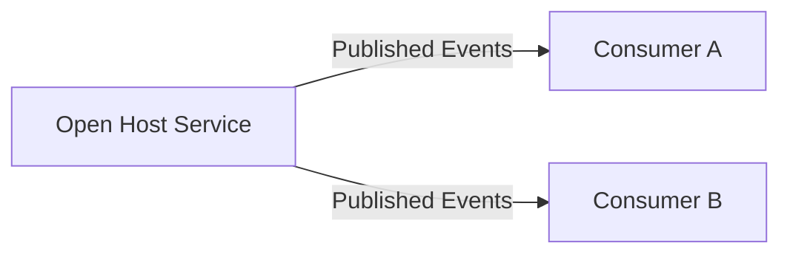
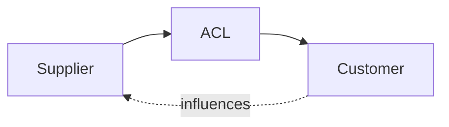
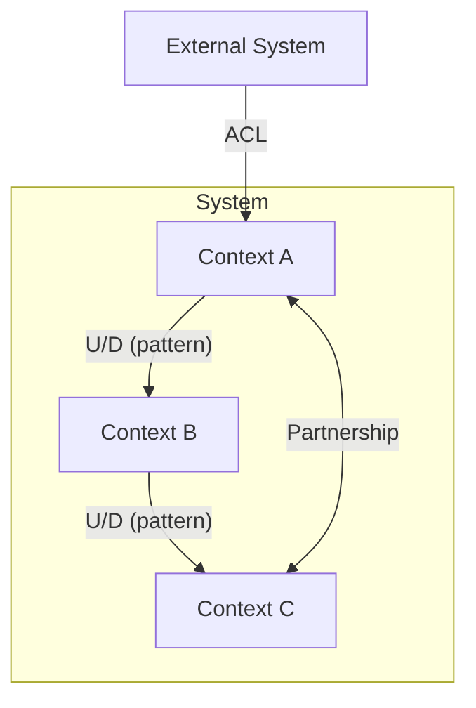

# Context Mapping Patterns

Reference for selecting appropriate integration patterns between Bounded Contexts.

## Pattern Selection Guide

| Situation | Recommended Pattern |
|-----------|---------------------|
| Same team, co-evolving contexts | Partnership |
| Small shared model where ACL duplication cost is unjustifiable | Shared Kernel (last resort — prefer ACL) |
| Clear producer/consumer, consumer has influence | Customer-Supplier |
| Consumer must accept producer's model | Conformist |
| Consumer must protect its model from producer | Anti-Corruption Layer |
| Producer serves many consumers with stable API | Open Host Service |
| Contexts communicate via well-defined schema | Published Language |
| No integration needed | Separate Ways |

---

## Pattern Details

### Partnership

**When**: Two contexts co-evolve together, typically owned by the same team or tightly coordinating teams.

**Characteristics**:
- Mutual dependency
- Coordinated planning and releases
- Shared success/failure

**Signals**:
- Teams sit together or communicate daily
- Changes to one context often require changes to the other
- No clear upstream/downstream

**Risks**:
- Can become a distributed monolith
- Coordination overhead scales with team size

**Diagram**:

```mermaid
graph LR
    A[Context A] <-->|Partnership| B[Context B]
```

---

### Shared Kernel

**When**: A small, well-defined part of the domain model is shared between contexts, and the cost of maintaining separate models with ACL translation cannot be justified due to complexity or performance constraints.

**Default stance: Avoid Shared Kernel.** Each context should own its own model. Use Anti-Corruption Layers to translate between contexts. Only consider Shared Kernel when:
- Duplicating the model creates a genuine maintenance liability (e.g., complex, regulated tax calculation logic used identically by two contexts)
- Cross-service calls for frequently accessed shared data introduce unacceptable latency, and caching is insufficient
- The shared concepts are truly stable and mean the same thing in both contexts (e.g., `Money`, `Currency`, `Address`)

**Characteristics**:
- Limited shared code/model — a deliberately designated subset, not accidental overlap
- Any change requires agreement from both teams
- Tight coupling by design (for a specific, documented reason)

**Signals that Shared Kernel may be appropriate**:
- Common domain concepts that must stay perfectly synchronized (not just similar)
- Core identity or reference data that is identical across contexts
- Very stable, rarely-changing shared elements where duplication cost exceeds coupling risk

**Signals to use ACL instead**:
- The concept has even slightly different semantics in each context
- The shared model is still evolving or being discovered
- Teams deploy on independent schedules
- Simple value objects that are trivially duplicated (e.g., a `Name` string, a `Status` enum)

**Risks**:
- Kernel can grow uncontrolled — resist adding "just one more thing"
- Change coordination becomes a bottleneck, slowing all consuming contexts
- Creates a "lowest common denominator" model that may be optimal for no context
- In distributed systems, all consumers must coordinate deployments for kernel changes

**Implementation approaches**:

| Topology | Approach | Example |
|----------|----------|---------|
| Monolith (shared package) | Dedicated internal package imported by multiple contexts | `internal/shared-kernel/money.go` imported by both `ordering` and `billing` |
| Microservices (shared library) | Versioned Go module with its own `go.mod`, published to internal registry | `go get company.com/shared-kernel@v1.2.0` |
| Microservices (shared database) | One service owns the schema; the other reads through a well-defined view or API. This is closer to Customer-Supplier than true Shared Kernel. | Service A owns the `products` table; Service B reads via a read-only view |

**What belongs in a shared kernel**:
- Stable value objects: `Money`, `Currency`, `Address`, `EmailAddress`
- Typed identifiers shared across contexts: `CustomerId`, `OrderId`
- Domain event contracts that cross context boundaries

**What does NOT belong**:
- Core domain entities (creates tight coupling to another context's lifecycle)
- Domain-specific business logic (should remain context-local)
- Anything that changes frequently

**Guidelines**:
- Keep kernel as small as possible — regularly review and extract anything that has become context-specific
- Document exactly what's shared and why (use ADRs for kernel additions)
- Require explicit approval for kernel changes
- One team should be the primary steward, even in a shared kernel
- Treat the kernel like an external API: use semantic versioning, maintain backward compatibility
- Run consumer integration tests as part of the kernel's CI pipeline

**Diagram**:

```mermaid
graph LR
    A[Context A] --- K((Shared Kernel)) --- B[Context B]
```

---

### Customer-Supplier

**When**: Clear upstream (supplier) and downstream (customer) relationship where the customer can influence the supplier's priorities.

**Characteristics**:
- Downstream depends on upstream
- Downstream needs are considered in upstream planning
- Negotiated interface

**Signals**:
- Downstream team can request features/changes
- Upstream team accepts responsibility to serve downstream
- Power balance allows negotiation

**Diagram**:

```mermaid
graph LR
    Supplier[Upstream: Supplier] -->|serves| Customer[Downstream: Customer]
    Customer -.->|influences| Supplier
```

---

### Conformist

**When**: Downstream must accept the upstream model without ability to influence it.

**Characteristics**:
- Downstream adopts upstream's model as-is
- No translation layer
- Upstream dictates terms

**Signals**:
- External service or legacy system
- Upstream team has no bandwidth for downstream needs
- Upstream model is acceptable (not harmful) to downstream

**Risks**:
- Downstream model polluted by upstream concepts
- Changes in upstream ripple through downstream

**When NOT to Use**:
- If upstream model would corrupt downstream domain, use ACL instead

**Diagram**:

```mermaid
graph LR
    Upstream[Upstream] -->|model imposed| Downstream[Downstream: Conformist]
```

---

### Anti-Corruption Layer (ACL)

**When**: Downstream must protect its model from upstream concepts that don't fit.

**Characteristics**:
- Translation layer between contexts
- Downstream model stays pure
- Adapter pattern at the boundary

**Signals**:
- Upstream uses different terminology
- Upstream model would pollute downstream domain
- Legacy system integration
- Third-party API with foreign concepts

**Implementation**:
- Translators: Convert between models
- Adapters: Wrap upstream interfaces
- Facades: Simplify upstream complexity

**Diagram**:

```mermaid
graph LR
    Upstream[Upstream] --> ACL[Anti-Corruption Layer]
    ACL --> Downstream[Downstream]
```

---

### Open Host Service

**When**: Upstream provides a well-defined, stable protocol for many consumers.

**Characteristics**:
- Public API or service
- Multiple downstream consumers
- Versioned, documented interface

**Signals**:
- Context serves as a platform
- Multiple teams consume the service
- Need for stability and backward compatibility

**Combines With**: Often uses Published Language for the protocol definition.

**Diagram**:

```mermaid
graph LR
    Host[Open Host Service] --> A[Consumer A]
    Host --> B[Consumer B]
    Host --> C[Consumer C]
```

---

### Published Language

**When**: Contexts communicate via a well-documented, shared interchange format.

**Characteristics**:
- Common schema/protocol
- Not a shared model (just interchange format)
- Often events or data contracts

**Signals**:
- Event-driven architecture
- Multiple producers/consumers of same message type
- Need for interoperability

**Examples**:
- Domain events with defined schema
- Industry-standard formats
- Protocol buffers, JSON schemas

**Diagram**:

```mermaid
graph LR
    A[Context A] -->|Events| PL((Published Language))
    PL --> B[Context B]
    PL --> C[Context C]
```

---

### Separate Ways

**When**: No integration needed between contexts.

**Characteristics**:
- Contexts operate independently
- No shared data or communication
- Duplication is acceptable

**Signals**:
- Integration cost exceeds benefit
- Contexts serve completely different purposes
- Data overlap is minimal and can be duplicated

**Risks**:
- May miss legitimate integration needs
- Data inconsistency if contexts do overlap

---

## Combination Patterns

Patterns often combine:

### Open Host + Published Language
Standard pattern for event-driven systems:

```mermaid
graph LR
    Host[Open Host Service] -->|Published Events| A[Consumer A]
    Host -->|Published Events| B[Consumer B]
```

### Customer-Supplier + ACL
When downstream has influence but still needs protection:

```mermaid
graph LR
    Supplier[Supplier] --> ACL[ACL]
    ACL --> Customer[Customer]
    Customer -.->|influences| Supplier
```

---

## Context Map Diagram Conventions

### Standard Notation

```mermaid
graph TB
    subgraph System
        A[Context A]
        B[Context B]
        C[Context C]
    end
    
    A -->|"U/D (pattern)"| B
    B -->|"U/D (pattern)"| C
    A <-->|"Partnership"| C
    
    External[External System] -->|"ACL"| A
```

**Legend**:
- `U/D`: Upstream/Downstream direction
- Solid arrows: Data/message flow
- Dashed arrows: Influence
- Double arrows: Bidirectional (Partnership)

### Relationship Documentation

For each relationship, document:

| Aspect | Description |
|--------|-------------|
| **Pattern** | Selected integration pattern |
| **Direction** | Who is upstream/downstream |
| **Interface** | Commands, Events, Queries exchanged |
| **Translation** | If ACL, what gets translated |
| **Rationale** | Why this pattern was chosen |
| **PRD Ref** | Integration touchpoint IDs |
