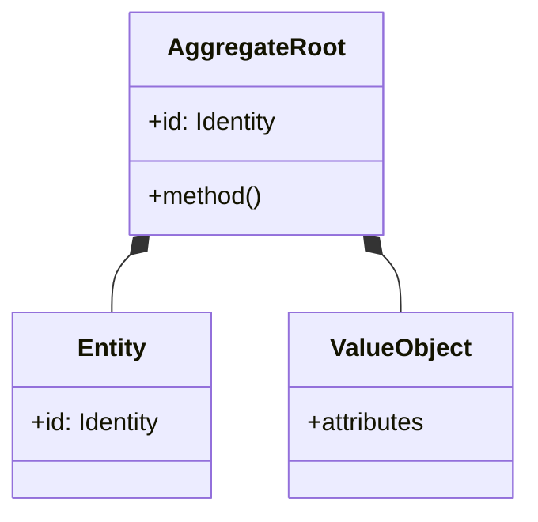
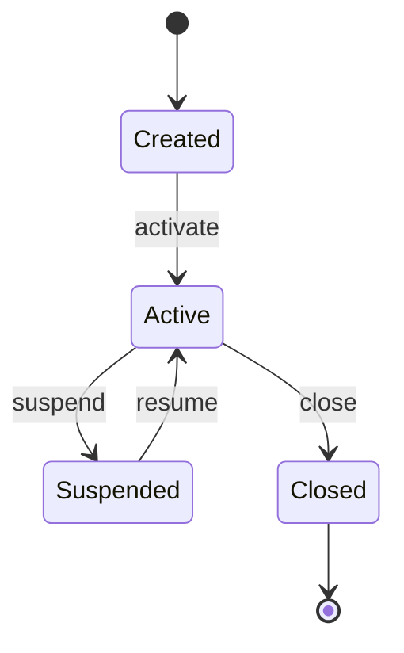
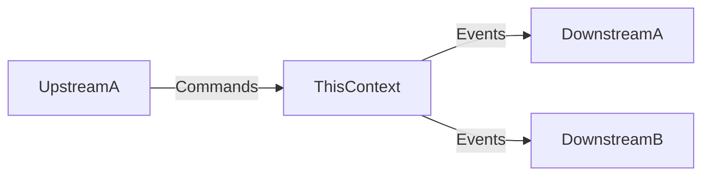

# Fully Qualified Bounded Context Template

Complete template for FQBC documents. Each Bounded Context gets its own document following this structure.

## Document Structure

```
1. Context Identity
2. Ubiquitous Language
3. Required Behaviors
4. Domain Model
5. Authorization
6. Published Interface
7. API Binding (when HTTP API exposed)
8. Context Relationships
9. Traceability
```

---

## 1. Context Identity

```markdown
# FQBC: [Context Name]

## Context Identity

**Name**: [Unique, descriptive name reflecting the business subdomain]

**Description**: [2-3 sentences explaining what this context does and the value it delivers]

**Boundary Rationale**: [Why this is a distinct context — what cohesion principles apply]

### Boundary Principles

The boundaries of this context are defined by:

- **Linguistic boundary**: [Terms that have specific meaning here]
- **Ownership boundary**: [Who owns/maintains this context]
- **Consistency boundary**: [What must be immediately consistent]
- **Change boundary**: [What changes together]
```

---

## 2. Ubiquitous Language

```markdown
## Ubiquitous Language

These terms have specific, unambiguous meaning within this Bounded Context.

| Term | Definition | Notes |
|------|------------|-------|
| [Term] | [Precise definition in this context] | [Variants, related terms, warnings] |

### Glossary Delta

Terms that evolved from PRD definitions:

| Term | PRD Definition | FQBC Definition | Reason for Change |
|------|----------------|-----------------|-------------------|
| [Term] | [Original] | [Refined] | [Why changed] |
```

---

## 3. Required Behaviors

```markdown
## Required Behaviors

Functional requirements this context must fulfill. Each behavior maps to PRD requirements.

### Behavior Catalog

| ID | Behavior | Actor | Trigger | Outcome | PRD Ref |
|----|----------|-------|---------|---------|---------|
| BH-01 | [What the context does] | [Who initiates] | [What starts it] | [Result] | FR-XX |

### Behavior Details

#### BH-01: [Behavior Name]

**User Story**: As a [role], I want to [action], so that [benefit].

**Preconditions**:
- [What must be true before]

**Postconditions**:
- [What must be true after]

**Business Rules Applied**:
- BR-XX: [Rule that governs this behavior]

**Acceptance Criteria**:
- [ ] [Testable criterion]
```

---

## 4. Domain Model

```markdown
## Domain Model

Conceptual model for this Bounded Context. Describes business concepts and rules, not technical implementation.

### Business Rules

Rules that govern this context. These are first-class citizens of the model.

| ID | Rule | Type | Enforced By | PRD Ref |
|----|------|------|-------------|---------|
| BR-XX | [Rule statement] | Invariant/Pre/Post/Derivation | [Aggregate/Service] | BR-XX |

#### Rule Details

##### BR-XX: [Rule Name]

**Statement**: [Full rule in domain language]

**Rationale**: [Why this rule exists in the business]

**Violation Handling**: [What happens when violated]

### Aggregates

Clusters of objects treated as a single unit for data changes.

#### [Aggregate Name]

**Root Entity**: [Entity that serves as the entry point]

**Invariants Protected**:
- [What must always be true within this aggregate]

**Entities**:
- [Entity]: [Identity, role in aggregate]

**Value Objects**:
- [VO]: [Attributes, role in aggregate]

**Lifecycle**:
```
[State] → [State] → [State]
```

### Entities

Objects with identity that persists through state changes.

| Entity | Identity | Key Attributes | Lifecycle |
|--------|----------|----------------|-----------|
| [Entity] | [What makes it unique] | [Important attributes] | [States] |

### Value Objects

Objects defined by their attributes, no distinct identity.

| Value Object | Attributes | Equality | Usage |
|--------------|------------|----------|-------|
| [VO] | [Attribute list] | [When two are equal] | [Where used] |

### Domain Services

Operations that don't naturally fit in an Entity or Value Object.

| Service | Operation | Inputs | Output | Rules Applied |
|---------|-----------|--------|--------|---------------|
| [Service] | [What it does] | [Parameters] | [Result] | [BR-IDs] |
```

---

## 5. Authorization

```markdown
## Authorization

How this context handles authorization decisions.

### Authorization Pattern

**Pattern**: [From manifest — permissions-object | rbac | abac | context-specific]

**Permissions Source**: [Where/how permissions are resolved — e.g., "Service middleware builds Permissions object from JWT claims using this context's role definitions"]

### Permission Requirements

Operations in this context require these permissions:

| Operation | Required Permission | Check Method |
|-----------|---------------------|--------------|
| [CommandName] | [Role or capability] | `permissions.hasAnyRole('Admin', 'Manager')` |
| [CommandName] | [Role or capability] | `permissions.canAccess('resource', 'write')` |
| [QueryName] | [Role or capability — often "authenticated user"] | `permissions.isAuthenticated()` |

### Permission Definitions

Permissions used by this context:

| Permission | Description | Typical Roles |
|------------|-------------|---------------|
| [permission.name] | [What this permission allows] | Admin, Manager |

### Authorization Boundary

**This context expects**:
- Authenticated identity (e.g., JWT claims) provided by upstream authentication
- Service middleware builds Permissions object using this context's role definitions
- Permissions object passed to handlers via [mechanism — e.g., request context, dependency injection]

**This context owns**:
- Role definitions relevant to its domain (e.g., `OrderManager`, `InventoryClerk`)
- Permission resolution logic in its middleware layer

**This context does NOT**:
- Rely on a central authorization service for role definitions
- Query external services during permission checks
- Share its role definitions with other contexts

### Unauthorized Handling

When authorization fails:
- **Response**: 403 Forbidden
- **Error Code**: `FORBIDDEN`
- **Message**: "Caller lacks required permissions for [operation]"
```

---

## 6. Published Interface

```markdown
## Published Interface

The contract this context exposes for communication with other contexts.

### Inbound Commands

Messages that tell this context to perform an action. Directed at this context specifically.

| Command | Description | Payload | Rules Applied | Response |
|---------|-------------|---------|---------------|----------|
| [CommandName] | [What it does] | [Key fields] | BR-XX | Success/Failure |

#### Command Details

##### [CommandName]

**Intent**: [What the caller wants to achieve]

**Authorization**: [Required permissions — use pattern from manifest.authorization]
- Example (Permissions Object): `permissions.hasAnyRole('Admin', 'Manager')` or `permissions.canAccess('resource', 'write')`
- Example (RBAC): Requires role `ADMIN` or `MANAGER`

**Payload**:
```
{
  field: type — description
  field: type — description
}
```

**Preconditions**: [What must be true]

**Success Response**: [What caller receives on success]

**Failure Scenarios**:
- **Unauthorized**: 403 Forbidden — caller lacks required permissions
- [Condition]: [Response]

### Inbound Queries

Messages that request information without changing state.

| Query | Description | Parameters | Response |
|-------|-------------|------------|----------|
| [QueryName] | [What it retrieves] | [Inputs] | [Output shape] |

#### Query Details

##### [QueryName]

**Intent**: [What the caller wants to know]

**Parameters**:
```
{
  param: type — description
}
```

**Response**:
```
{
  field: type — description
}
```

### Outbound Events

Messages announcing facts that occurred. Broadcast to interested consumers.

| Event | Trigger | Payload | Consumers |
|-------|---------|---------|-----------|
| [EventName] | [When emitted] | [Key fields] | [Who cares] |

#### Event Details

##### [EventName]

**Trigger**: [What causes this event]

**Payload**:
```
{
  field: type — description
}
```

**Guarantees**: [Delivery semantics, ordering]
```

---

## 7. API Binding

When this context exposes an HTTP API, specify concrete bindings that map domain operations to HTTP endpoints.

```markdown
## API Binding

This section maps domain Commands and Queries to concrete HTTP endpoints.

### Context API Configuration

| Setting | Value |
|---------|-------|
| Context slug | [kebab-case identifier, e.g., `surveillance-items`] |
| Base path | `/api/[context-slug]/v1` |

### Command Bindings

Commands map to state-changing HTTP methods (POST, PUT, PATCH, DELETE).

| Command | Method | Path | Authorization | Request Body | Success | Errors |
|---------|--------|------|---------------|--------------|---------|--------|
| [CommandName] | POST/PATCH/PUT/DELETE | `/resource` or `/resource/{id}` | [Required permission] | `{ field: type }` | 200/201 | 400, 403, 404, 409 |

#### [CommandName] Binding

**Endpoint**: `[METHOD] /api/[context-slug]/v1/[path]`

**Authorization**:
- Required: `[permission check, e.g., permissions.hasAnyRole('Admin')]`
- Permissions object built by: service middleware (from JWT claims)

**Request**:
```json
{
  "field": "type — description"
}
```

**Response** (success):
```json
{
  "success": true,
  "data": {
    "field": "type — description"
  }
}
```

**Error Responses**:
| Status | Code | When |
|--------|------|------|
| 400 | VALIDATION_ERROR | [condition] |
| 403 | FORBIDDEN | Caller lacks required permissions |
| 404 | NOT_FOUND | [condition] |
| 409 | CONFLICT | [condition] |

### Query Bindings

Queries map to GET requests.

| Query | Path | Query Parameters | Response |
|-------|------|------------------|----------|
| [QueryName] | `/resource` | `param1, param2` | `{ data: [...] }` |

#### [QueryName] Binding

**Endpoint**: `GET /api/[context-slug]/v1/[path]`

**Query Parameters**:
| Parameter | Type | Required | Description |
|-----------|------|----------|-------------|
| page | integer | No | Page number (1-indexed, default: 1) |
| pageSize | integer | No | Items per page (default: 20, max: 100) |
| [filter] | string | No | [description] |

**Response**:
```json
{
  "success": true,
  "data": {
    "items": [...],
    "totalCount": 100
  },
  "meta": {
    "page": 1,
    "pageSize": 20
  }
}
```

### Internal Endpoints

Endpoints for context-to-context communication (not exposed externally).

| Operation | Method | Path | Consumer |
|-----------|--------|------|----------|
| [OperationName] | GET/POST | `/internal/[path]` | [Context name] |
```

**When to include this section:**
- Context has user-facing HTTP endpoints
- Context exposes internal APIs consumed by other contexts
- Skip if context is purely event-driven (no synchronous API)

**Reference**: See `api-conventions.md` in the skill directory for project-wide HTTP conventions.

---

## 8. Context Relationships

```markdown
## Context Relationships

How this context relates to others in the system.

### Upstream Dependencies

Contexts this context depends on.

| Context | Pattern | What We Need | Their Obligations |
|---------|---------|--------------|-------------------|
| [Context] | [Integration pattern] | [Commands/Queries we call] | [What they provide] |

### Downstream Consumers

Contexts that depend on this context.

| Context | Pattern | What They Need | Our Obligations |
|---------|---------|----------------|-----------------|
| [Context] | [Integration pattern] | [Events/Queries they use] | [What we provide] |

### External Systems

| System | Direction | Pattern | Interface |
|--------|-----------|---------|-----------|
| [System] | Inbound/Outbound | [Pattern] | [How we integrate] |
```

---

## 9. Traceability

```markdown
## Traceability

Links to source PRD and design decisions.

### PRD References

| FQBC Element | PRD Reference | Notes |
|--------------|---------------|-------|
| BH-01 | FR-area-01 | Direct mapping |
| BR-01 | BR-01 | Rule unchanged |
| [Term] | Glossary | Definition refined |

### Design Decisions

| Decision | Rationale | Alternatives Considered |
|----------|-----------|------------------------|
| [Boundary choice] | [Why] | [Other options] |
| [Pattern choice] | [Why] | [Other options] |

### Open Questions

| Question | Impact | Owner |
|----------|--------|-------|
| [Unresolved issue] | [What it affects] | [Who decides] |
```

---

## Output Format Notes

### Mermaid Diagrams

Useful diagrams for FQBC:

**Aggregate Structure**:


**State Machine**:


**Context Relationships**:


### Markdown Output

For markdown, include Mermaid as fenced code blocks:

~~~markdown
```mermaid
[diagram code]
```
~~~

### Notion Output

Use `Notion:notion-create-pages` with:
- Toggle blocks for collapsible details
- Database blocks for catalogs
- Callout blocks for rules and warnings
