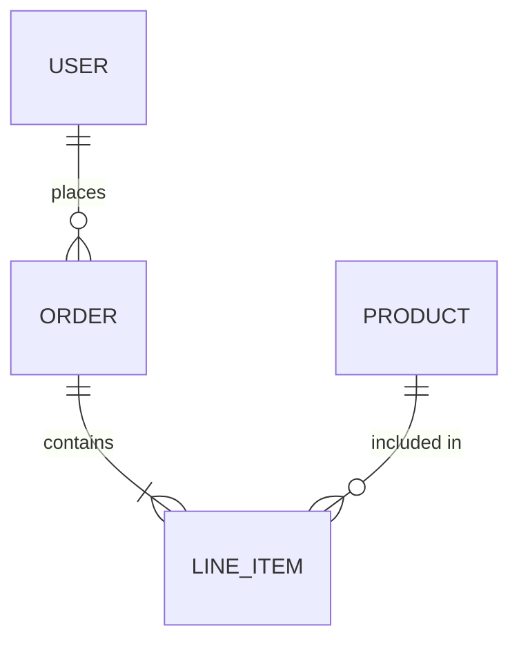
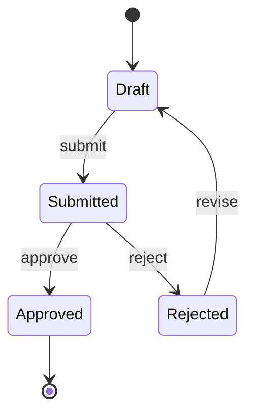
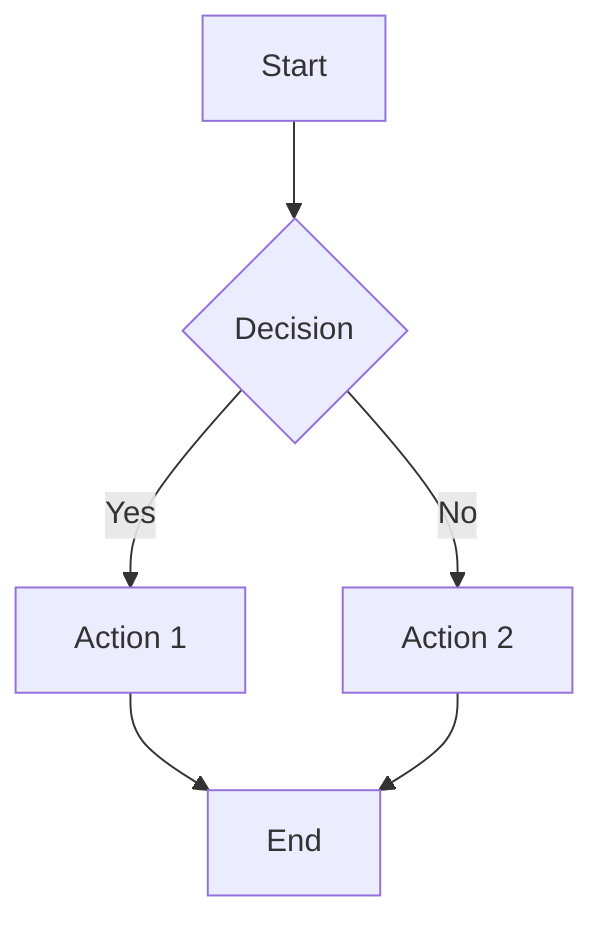
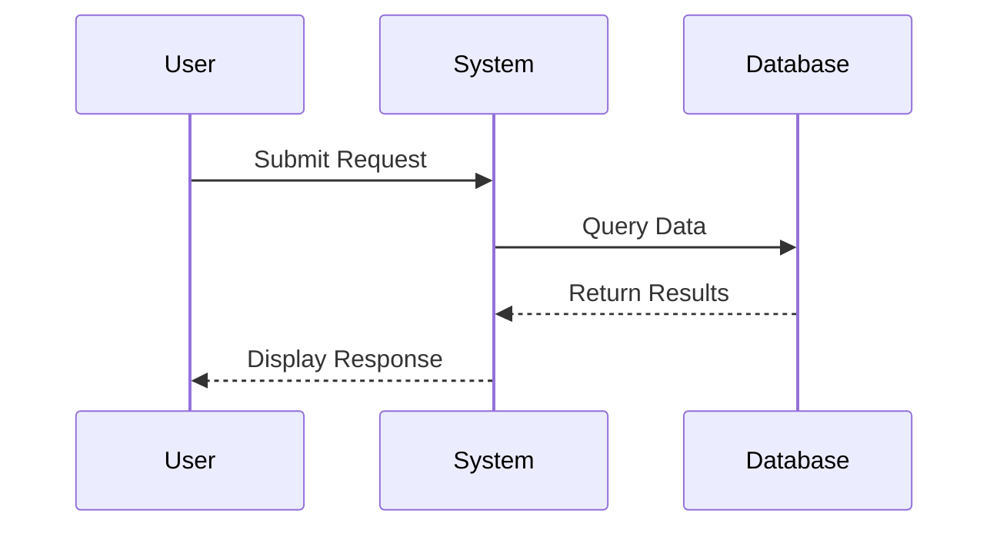

# Output Format

This command produces Markdown documents optimized for rendering in Obsidian and similar tools that natively support Mermaid diagrams and formatted tables.

## Markdown Structure

```markdown
# Product Requirements Document
## [Project Name] — [Scope]

**Version**: 1.0
**Date**: [Date]
**Project ID**: [ID]

---

## Table of Contents
1. [Executive Summary](#1-executive-summary)
2. [Background & Context](#2-background--context)
...

---

## 1. Executive Summary
[Content]

## 2. Background & Context
[Content]

...

---

## Appendix
[References, links]
```

## Mermaid Diagrams

Use fenced code blocks with the `mermaid` language identifier. Obsidian renders these natively.

### Entity Relationship Diagrams

~~~markdown

~~~

### State Diagrams

~~~markdown

~~~

### Flowcharts

~~~markdown

~~~

### Sequence Diagrams

~~~markdown

~~~

## Tables

Use standard Markdown tables. Obsidian renders these with sorting and formatting.

```markdown
| Column 1 | Column 2 | Column 3 |
|----------|----------|----------|
| Data | Data | Data |
| Data | Data | Data |
```

### Alignment

```markdown
| Left | Center | Right |
|:-----|:------:|------:|
| L | C | R |
```

## Checkbox Lists

Use standard Markdown checkboxes. Obsidian renders these as interactive checkboxes.

```markdown
**Acceptance Criteria**:
- [ ] User can submit the form
- [ ] System validates required fields
- [x] Error messages display inline
```

## File Naming

Use descriptive, kebab-case file names:

```
prd-[project-name]-[scope].md
```

Examples:
- `prd-inventory-system-poc.md`
- `prd-user-auth-mvp.md`
- `prd-reporting-dashboard-phase1.md`

## Output Location

All PRD documents should be written to the `ddd-workspace/` directory in the current project root. Create this directory if it does not exist.

```
project-root/
└── ddd-workspace/
    └── prd-[project-name]-[scope].md
```
