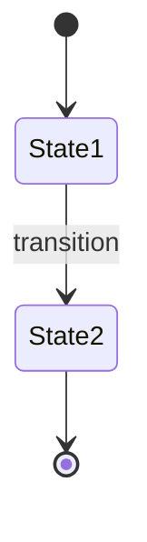

# PRD Schema

This document defines the structure and content of a lean PRD for PoC development. PRDs following this schema are designed to feed downstream Bounded Context Review and Domain-Driven Design work.

## Purpose

PRDs produced using this schema:
- Define **what to build** (not how)
- Seed downstream Bounded Context Review and DDD work
- Provide traceability for requirements
- Organize requirements by functional cohesion (context candidates)

## Pipeline Context

This PRD feeds into a Bounded Context Review:

```
PRD                           →  Bounded Context Review     →  FQBC Documents
─────────────────────────────    ────────────────────────    ──────────────
• What to build                  • How to decompose          • Context details
• Business rules                 • Context mapping           • Ubiquitous language
• Behaviors by area              • Boundary decisions        • Contracts (C/E/Q)
• Domain terminology             • Integration patterns      • Domain model
• Conceptual entities            • Boundary rationale        • Aggregates
```

## Document Structure

### Required Sections

| # | Section | Purpose | DDD Relevance |
|---|---------|---------|---------------|
| 1 | Executive Summary | Quick overview | — |
| 2 | Background & Context | Why this exists | Problem domain |
| 3 | PoC Scope | What's in/out | Boundary definition |
| 4 | Functional Areas | Cohesive groupings | Context candidates |
| 5 | Functional Requirements | Detailed specs (by area) | Behaviors |
| 6 | Domain Glossary | Term definitions | Ubiquitous Language |
| 7 | Business Rules Catalog | Explicit policies | Domain invariants |
| 8 | Conceptual Entity Map | Things & relationships | Domain model seeds |
| 9 | Integration Touchpoints | External interactions | Context mapping |
| 10 | Role-Capability Matrix | Who can do what | Access policies |
| 11 | Non-Functional Requirements | Quality attributes | — |
| 12 | Success Criteria | How we know it works | — |
| 13 | Product Team Expectations | Tech context (not specs) | — |
| 14 | Traceability Index | Requirement IDs | FQBC citations |
| 15 | Appendix | References, links | — |

---

## Section Templates

### 1. Executive Summary

```markdown
## 1. Executive Summary

This PRD defines the scope for a [lean PoC / MVP / Phase 1] of [Project Name],
focusing on [scope description]. The [PoC/MVP] will validate [core hypothesis]
before expanding to [future scope].

**Objective**: [One sentence goal]

**Functional Areas**: This PRD organizes requirements into [N] functional areas
that represent potential Bounded Context boundaries for technical design.
```

### 2. Background & Context

```markdown
## 2. Background & Context

[Why this project exists, business drivers, current state problems]
```

### 3. PoC Scope

```markdown
## 3. PoC Scope

### 3.1 In Scope
[List of included capabilities with rationale]

### 3.2 Out of Scope

| Feature | Reason | Mitigation | Dependency |
|---------|--------|------------|------------|
| [Feature] | [Why deferred] | [How PoC handles absence] | [What would enable inclusion] |
```

### 4. Functional Areas

```markdown
## 4. Functional Areas

### 4.1 [Area Name]

**Cohesion Rationale**: [Why these features belong together]
**Key Terms**: [Domain terms specific to this area]
**Key Entities**: [Conceptual entities owned by this area]
**Stakeholder**: [Primary business owner]

#### Features
| ID | Feature | Description |
|----|---------|-------------|
| FR-[area]-01 | [Name] | [Brief description] |
```

### 5. Functional Requirements

```markdown
## 5. Functional Requirements

### 5.1 [Functional Area Name]

#### FR-[area]-01: [Feature Name]

**User Story**: As a [role], I want to [action], so that [benefit].

**Acceptance Criteria**:
- [ ] [Specific, testable criterion]
- [ ] [Specific, testable criterion]

**Business Rules**:
- BR-XX: [Rule reference from catalog]

**Conceptual Entities**:
- [Entity]: [What it represents, key attributes]

**Role-Capability**:
- [Role] can: [capability]
```

### 6. Domain Glossary

```markdown
## 6. Domain Glossary

Candidate terms for Ubiquitous Language. These terms have specific meanings
within this domain and should be used consistently across all documentation
and implementation.

| Term | Definition | Functional Area | Notes |
|------|------------|-----------------|-------|
| [Term] | [Domain-specific meaning] | [Area] | [Variants, caveats] |
```

### 7. Business Rules Catalog

```markdown
## 7. Business Rules Catalog

Explicit policies and constraints that govern the domain. These rules are
first-class artifacts that must be respected by any implementation.

| ID | Rule | Type | Entities | Area |
|----|------|------|----------|------|
| BR-01 | [Clear statement] | Invariant/Pre/Post/Derivation | [Governed entities] | [Area] |

### Rule Details

#### BR-01: [Rule Name]
**Statement**: [Full rule description]
**Rationale**: [Why this rule exists]
**Enforcement**: [When/how it must be enforced]
```

### 8. Conceptual Entity Map

```markdown
## 8. Conceptual Entity Map

Key things that exist in the domain. This describes what the business cares
about, not technical data models.

| Entity | Description | Key Attributes | Relationships | Area |
|--------|-------------|----------------|---------------|------|
| [Entity] | [What it represents] | [Important characteristics] | [Links to others] | [Area] |

### Entity Lifecycles

#### [Entity Name]



**Transitions**: [What triggers state changes]
```

### 9. Integration Touchpoints

```markdown
## 9. Integration Touchpoints

Points where functional areas or external systems must interact. These
inform Context Mapping decisions in technical design.

| From | To | Trigger | Data Flow | Timing | Notes |
|------|-----|---------|-----------|--------|-------|
| [Area/System] | [Area/System] | [Initiating event] | [What passes] | Sync/Async | [Constraints] |

### External Systems
- **[System]**: [What it provides, how we interact]
```

### 10. Role-Capability Matrix

```markdown
## 10. Role-Capability Matrix

Who can do what within the system. Informs authorization design.

| Role | Area | Capabilities | Restrictions |
|------|------|--------------|--------------|
| [Role] | [Area] | [What they can do] | [What they cannot do] |
```

### 11. Non-Functional Requirements

```markdown
## 11. Non-Functional Requirements

| Category | Requirement | Priority |
|----------|-------------|----------|
| Performance | [Requirement] | [P1/P2/P3] |
| Security | [Requirement] | [P1/P2/P3] |
| Availability | [Requirement] | [P1/P2/P3] |
```

### 12. Success Criteria

```markdown
## 12. Success Criteria

The [PoC/MVP] is successful when:

1. [Measurable outcome 1]
2. [Measurable outcome 2]
3. [Measurable outcome 3]
```

### 13. Product Team Expectations

```markdown
## 13. Product Team Expectations

The source documentation included technical concepts that provide context
for engineering. These are NOT specifications—engineering will determine
appropriate technical design during Bounded Context Review.

**Data Concepts**:
- [Concept]: [What product team envisioned and why]

**Integration Points**:
- [System]: [Expected interaction]

**Assumptions**:
- [Assumption product team made]
```

### 14. Traceability Index

```markdown
## 14. Traceability Index

Reference IDs for citation in Bounded Context Review and FQBC documents.

### Functional Requirements
| ID | Name | Area |
|----|------|------|
| FR-[area]-01 | [Feature] | [Area] |

### Business Rules
| ID | Summary |
|----|---------|
| BR-01 | [Brief rule] |

### Conceptual Entities
| ID | Entity |
|----|--------|
| CE-01 | [Entity name] |

### Integration Touchpoints
| ID | From → To |
|----|-----------|
| IT-01 | [Area] → [Area/System] |
```

---

## Validation Checklist

A complete PRD should have:

- [ ] All required sections present
- [ ] Every functional requirement has acceptance criteria
- [ ] Business rules are explicit (not buried in acceptance criteria)
- [ ] Domain terms are defined in glossary
- [ ] Entities have clear relationships
- [ ] Traceability IDs assigned (FR-XX, BR-XX, CE-XX, IT-XX)
- [ ] Functional areas have cohesion rationale
- [ ] Out-of-scope items have mitigation strategies

## Quality Criteria

### Functional Area Cohesion

Group features by cohesion, not UI or workflow similarity:
- **Shared terminology**: Same words mean same things
- **Shared entities**: Operate on same concepts
- **Shared rules**: Governed by same policies
- **Cohesive lifecycle**: Change together

### Business Rule Independence

Rules should be:
- Stated as constraints, not acceptance criteria
- Domain-centric (not UI-centric)
- Referenceable by ID
- Categorized by type (Invariant, Precondition, Postcondition, Derivation)

### Entity Clarity

Entities should describe:
- What the business cares about (not technical storage)
- Identity and key attributes
- Relationships to other entities
- Lifecycle states (if applicable)

---

## File Naming Convention

```
prd-[project-name]-[scope].md
```

Examples:
- `prd-inventory-system-poc.md`
- `prd-user-auth-mvp.md`
- `prd-reporting-dashboard-phase1.md`

## Output Location

PRD documents should be written to the `ddd-workspace/` directory in the current project.
